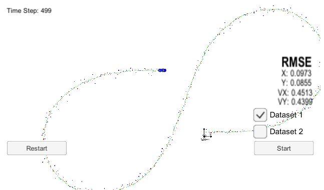
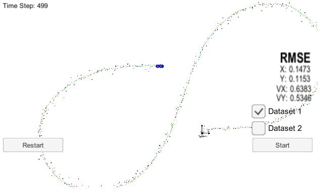
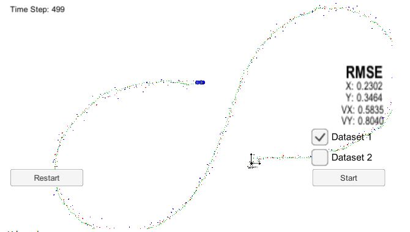

# Extended Kalman Filter Project 
Self-Driving Car Engineer Nanodegree Program -Term2 Project1 

My code built without error with cmake .. && make, and connected to GUI with ./ExtendedKF. 

With both LASER and RADAR data, the px,py,vx,vy RMSE = [.0973,.0855,.4513,.4399], less than the requirement [.11, .11, 0.52, 0.52]. 

With Lidar only, the route with RMSE are:

With Radar only, the route with RMSE are:

Both Lidar only and Radar only generates higher error compared to taking both data. Lidar only case's accuracy is little better than radar only in this case.

